# React Admin Dashboard  

This application is a fully responsive UI kit featuring an interactive dashboard. It includes various charts such as pie charts, line charts, bar charts, and area charts for data visualization. Additionally, it offers a profile settings page for user customization.  

## Technologies Used 🚀  
- **React.js**  
- **Tailwind CSS**  
- **Framer Motion**  
- **Recharts**  
- **React Router DOM**

## Demo 🎥  
[]

## Screenshots 🖼️ 
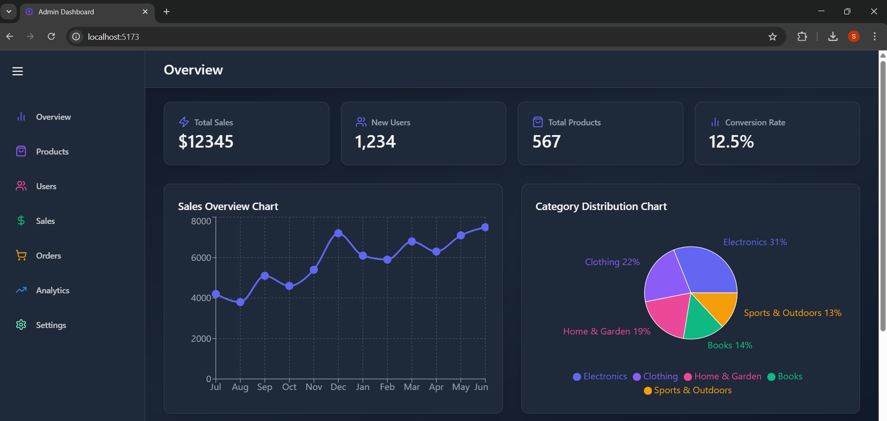
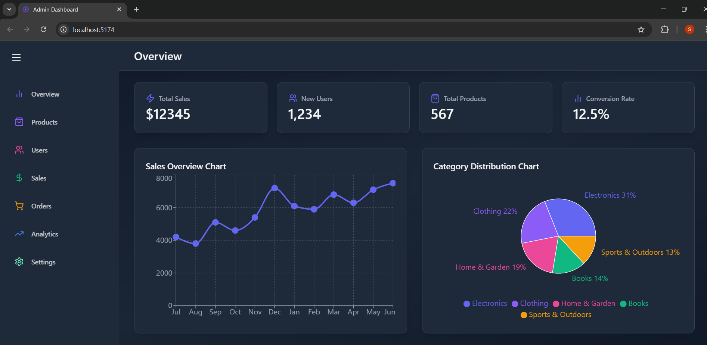
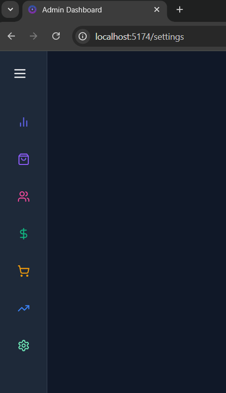
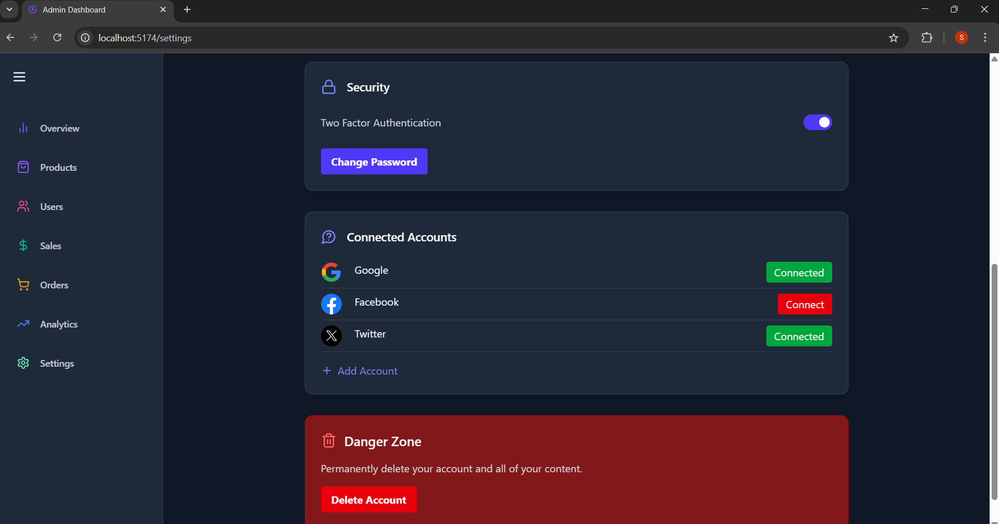
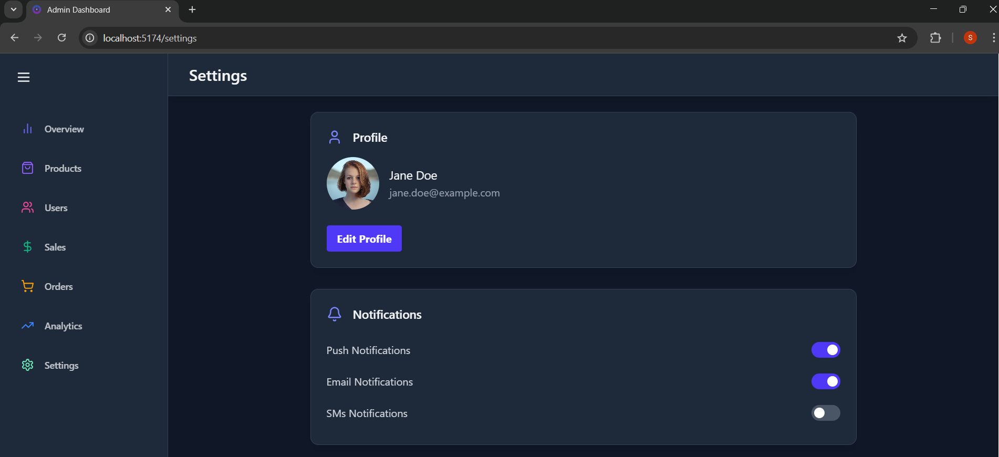
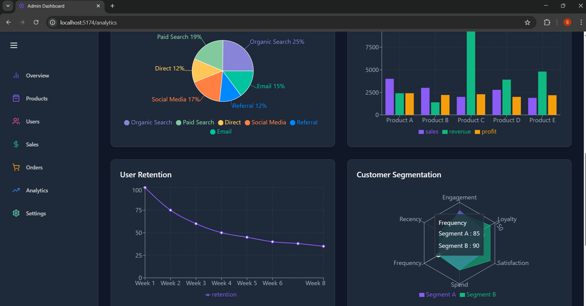
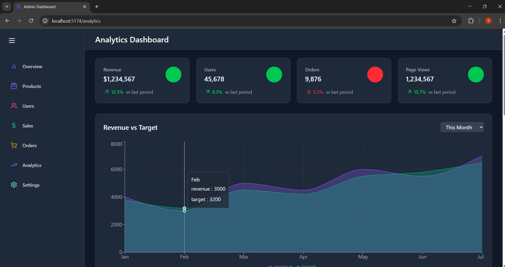
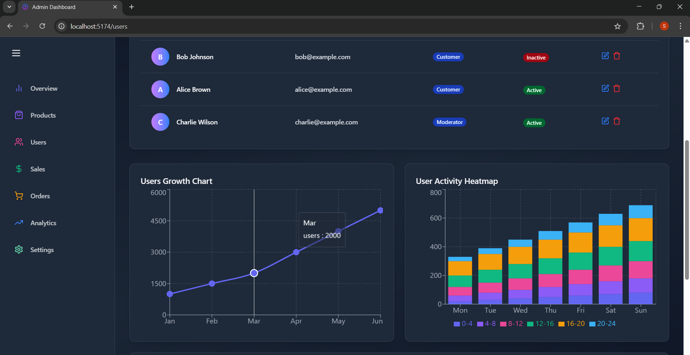
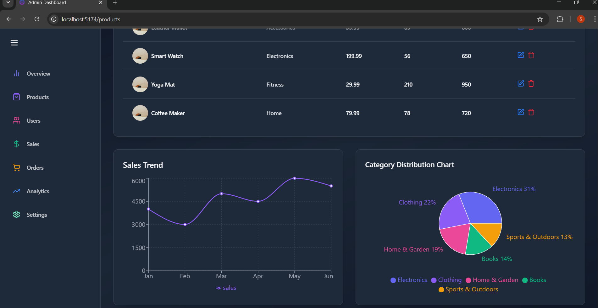
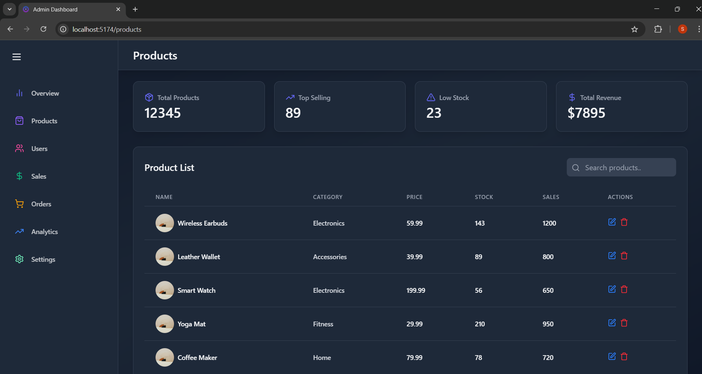
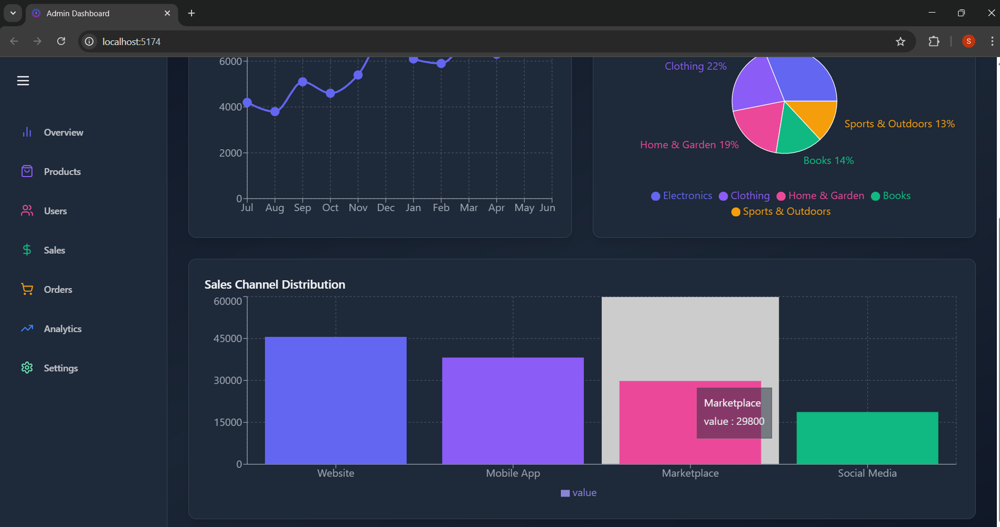

